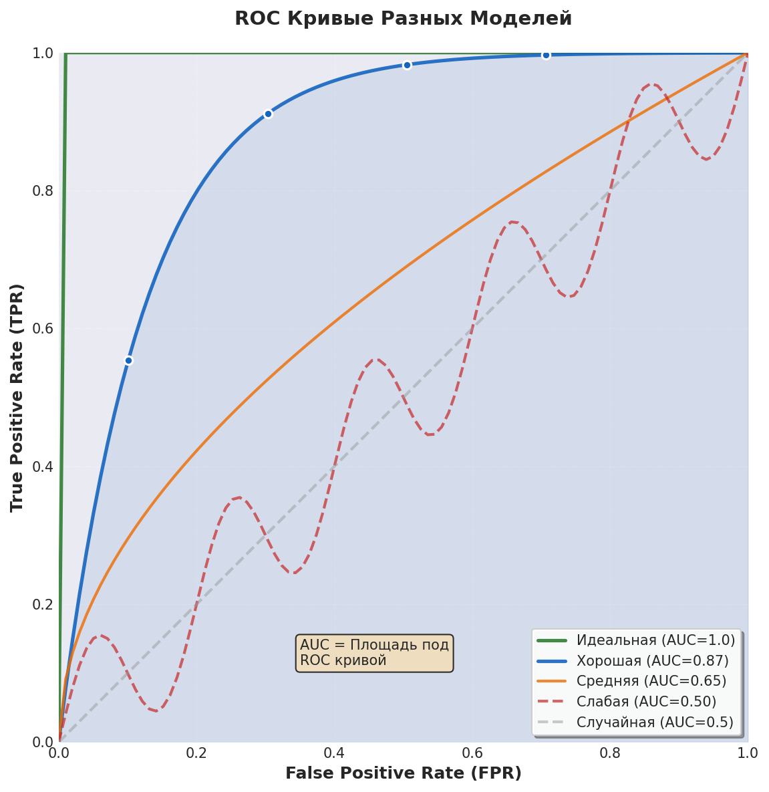

# ROC и AUC Анимации

Этот каталог содержит скрипты для создания анимированных иллюстраций к cheatsheet про ROC и AUC.

## Структура

```
animations/
├── README.md           # Этот файл
├── demo/              # Демо примеры
│   ├── roc_curve_demo.py          # Демо с matplotlib (работает сразу)
│   └── roc_curve_manim.py         # Manim версия (требует установки)
├── output/            # Выходные файлы (видео, SVG, PNG)
└── requirements.txt   # Зависимости Python
```

## Варианты реализации

### Вариант 1: Статичные SVG (текущий)
✅ **Готово** - Встроенные SVG иллюстрации в `cheatsheets/roc_auc_cheatsheet.html`

**Плюсы:**
- Работает сразу, без дополнительных зависимостей
- Можно печатать
- Малый размер файла
- Полная кастомизация

**Минусы:**
- Статичные, без анимации
- Ручное создание кривых

### Вариант 2: Matplotlib статика
✅ **Реализовано** - `demo/roc_curve_demo.py`

**Плюсы:**
- Программно генерируемые графики
- Легко создавать варианты
- Экспорт в SVG/PNG
- Математически точные кривые

**Минусы:**
- Без анимации
- Требует Python окружение

### Вариант 3: Manim анимации
⚠️ **В разработке** - `demo/roc_curve_manim.py`

**Плюсы:**
- Красивые плавные анимации
- Математически точные
- Профессиональное качество
- Экспорт в видео и SVG

**Минусы:**
- Требует установки Manim
- Долгий рендеринг
- Большие файлы (видео)
- Нельзя печатать анимации

## Установка

### Для matplotlib демо:
```bash
pip install -r requirements.txt
python demo/roc_curve_demo.py
```

### Для Manim (требует дополнительных системных пакетов):
```bash
# Ubuntu/Debian
sudo apt update
sudo apt install libcairo2-dev libpango1.0-dev ffmpeg

# MacOS
brew install cairo pango ffmpeg

# Установка Manim
pip install manim

# Запуск
manim demo/roc_curve_manim.py ROCCurveScene -pql
```

## Использование

### Matplotlib демо
```bash
cd animations
python demo/roc_curve_demo.py
# Создаст: output/roc_curve_comparison.png
#          output/roc_curve_comparison.svg
```

### Manim (когда установлен)
```bash
cd animations

# Низкое качество (быстро, для проверки)
manim demo/roc_curve_manim.py ROCCurveScene -pql

# Высокое качество (медленно, финальная версия)
manim demo/roc_curve_manim.py ROCCurveScene -pqh

# Экспорт последнего кадра как SVG
manim demo/roc_curve_manim.py ROCCurveScene -pql --format=png
```

## Выходные файлы

- **Видео**: `media/videos/roc_curve_manim/1080p60/ROCCurveScene.mp4`
- **SVG**: `output/*.svg`
- **PNG**: `output/*.png`

## Интеграция с cheatsheet

### Статичные изображения
Добавить в HTML:
```html

```

### Видео (для онлайн версии)
```html
<video controls width="400">
  <source src="../animations/media/videos/.../ROCCurveScene.mp4" type="video/mp4">
</video>
```

## Следующие шаги

1. ✅ Создать демо с matplotlib
2. ⚠️ Создать Manim скрипт
3. ⏳ Добавить анимацию матрицы ошибок
4. ⏳ Добавить анимацию выбора порога
5. ⏳ Создать интерактивную HTML версию

## Примеры команд

```bash
# Создать все демо-изображения
python demo/roc_curve_demo.py

# Рендерить Manim анимацию (низкое качество)
manim -pql demo/roc_curve_manim.py ROCCurveScene

# Рендерить только последний кадр
manim -pql -s demo/roc_curve_manim.py ROCCurveScene

# Экспорт в GIF
manim -pql --format=gif demo/roc_curve_manim.py ROCCurveScene
```
